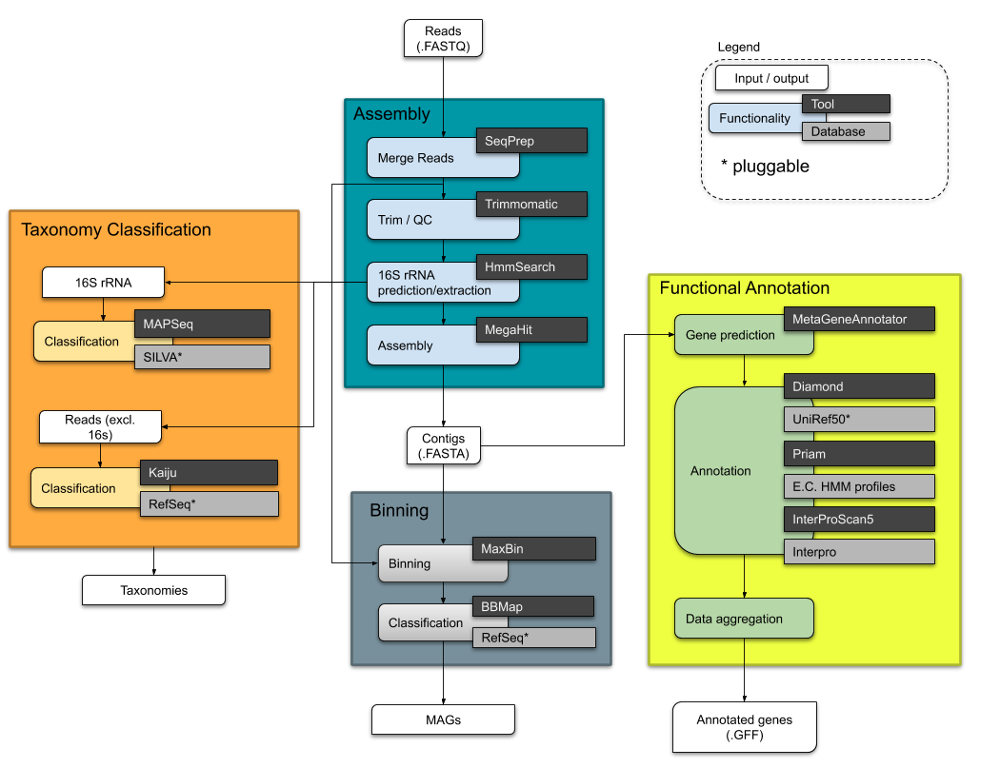
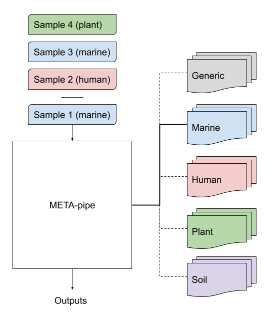

# Metapipe

[Metapipe](https://gitlab.com/uit-sfb/metapipe) is a workflow for analysis and annotation of metagenomic samples,
providing insight into phylogenetic diversity, as well as metabolic and functional properties of environmental communities.

As illustrated in the diagram below, the workflow is divided into four modules:
  - filtering and assembly
  - taxonomic classification
  - functional assignment
  - binning

  
*Metapipe workflow schematic*

The workflow was [designed](https://munin.uit.no/handle/10037/11180) to leverage the most modern tools to 
ensure both quality outputs and efficient resource usage.

In addition, it is now clear that the quality of the reference databases plays a role at least as important
as the tools themselves when it comes to output quality and execution speed.
This is why META-pipe makes use of *plugged-in* reference databases gathered into profiles.
For instance, the *Marine* profile uses exclusively the high quality [MAR databases](https://mmp.sfb.uit.no/databases/) as reference databases.

<div align="center">
    
</div>
*Metapipe profiles*

## Workflow as a service

todo

## Getting started

### Requirements

https://www.nextflow.io/docs/latest/getstarted.html#requirements

### Installing Nextflow

https://www.nextflow.io/docs/latest/getstarted.html#installation

### Executing the workflow

```bash
#Optional, only to fetch changes from repository
nextflow pull gitlab.com/uit-sfb/metapipe
nextflow run gitlab.com/uit-sfb/metapipe
```

### Debugging

Clone the repo, then:
```bash
mkdir -p target && cd target
nextflow run [-resume] ..
```